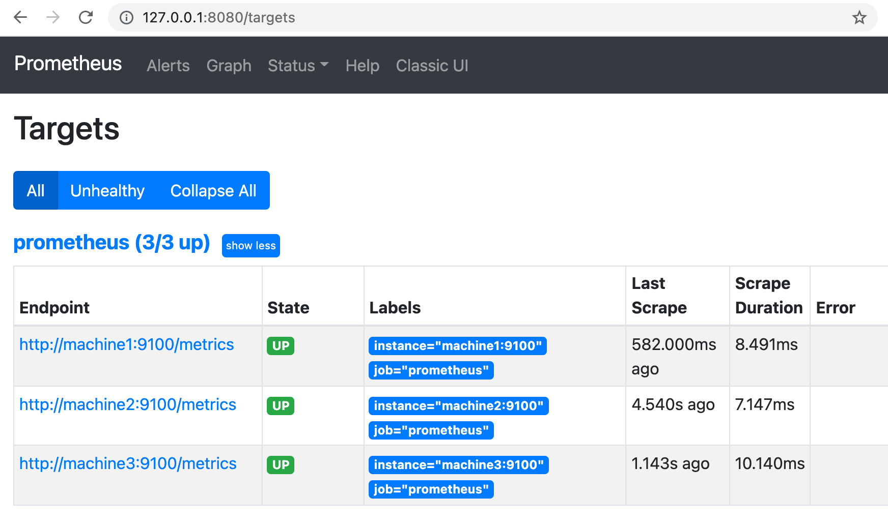

# Homework Assignment

This demo reproduces scenario 1 of the homework assignment (some type of central logging or monitoring).  I use [Vagrant](https://www.vagrantup.com/) and its capability to provision Vagrant-boxes via Ansible. The monitoring solution is [Prometheus](https://prometheus.io).


## Architecture

This Vagrant setup and Ansible provisioning creates N virtual machines (N can be configured in the Vagrantfile) and sets up the machines as follows:
- `machine1`: Prometheus server and NGINX reverse-proxy. Prometheus can be accessed on the host machine via NGINX-proxy (and Vagrant port forwarding) on http://127.0.0.1:8080. The Prometheus server gets the metrics from the monitoring clients via http-access on the node_exporter on the clients.
- `machine2...N`: Monitoring clients with the standard node_exporter on port 9100. Firewall rules allow access to the node_exporter URL only from `machine1`.

## Preparations

- install [Vagrant](https://www.vagrantup.com/)
- install virtualization (e.g. Virtualbox on Linux, Parallels on Mac)
- install Ansible
- clone this repo
- install requirements for Ansible
  `ansible-galaxy install -r provisioning/requirements.yml`

## Provisioning

`vagrant up` in the repo directory will spin up some VMs and create an internal network 192.168.77.0/24. Port 80 of machine1 will be port-forwarded from the host machine and port 8080 (http://127.0.0.1:8080).
As soon as the the last machine has spinned up the provisioning via Ansible begins by automatically creating an inventory file in `.vagrant/provisioners/ansible/inventory/vagrant_ansible_inventory`.
The inventory file on my machine looks like
```
# Generated by Vagrant

machine3 ansible_host=10.211.55.18 ansible_port=22 ansible_user='vagrant' ansible_ssh_private_key_file='/Users/myuser/git/ansible-dlp-homework/.vagrant/machines/machine3/parallels/private_key' internal_ip=192.168.77.23
machine2 ansible_host=10.211.55.16 ansible_port=22 ansible_user='vagrant' ansible_ssh_private_key_file='/Users/myuser/git/ansible-dlp-homework/.vagrant/machines/machine2/parallels/private_key' internal_ip=192.168.77.22
machine1 ansible_host=10.211.55.17 ansible_port=22 ansible_user='vagrant' ansible_ssh_private_key_file='/Users/myuser/git/ansible-dlp-homework/.vagrant/machines/machine1/parallels/private_key' internal_ip=192.168.77.21

[servers]
machine1

[clients]
machine2
machine3
```

Then the playbook `provisioning/playbook.yml` will be run by Vagrant and the machines will be setup according to their groups (clients, servers).

After provisioning login with user/password `test/test` in http://127.0.0.1:8080 should be possible. Prometheus-server should be running on machine1 and the node_exporters of all machines should be up (http://127.0.0.1:8080/targets):


If it is necessary to provision again we can use
```
vagrant provision
```
or execute ansible directly on the host machine with all possible options:
```
export ANSIBLE_INVENTORY=".vagrant/provisioners/ansible/inventory/vagrant_ansible_inventory"
ansible-playbook -i provisioning/playbook.yml
```

## Challenges

Besides some Ruby struggles in Vagrantfile I was faced with the following challenges:
- How to get the IP adresses of the internal network?  I decided to create an inventory variable `internal_ip` in Vagrantfile where the internal IP is known. I know that we could also get the IP addresses via setup but then all machines need to be up on configuration of the Prometheus server (which is the case in the demo environment but not in the real world).
- Establish hostname resolution and fill `/etc/hosts` via looping over the inventory and using `internal_ip` in role `common`:
  ```
  - name: set hostname resolution for Vagrant
  lineinfile:
    dest: /etc/hosts
    regexp: ".*{{ item }}$"
    line: "{{ hostvars[item].internal_ip }} {{item}}"
    state: present
  when: hostvars[item].internal_ip is defined
  loop: "{{ groups['all'] }}"
  ```
- How to use a role from Ansible Galaxy, keep it separate and use my own configuration? I created two roles `myprometheus-server` and `myprometheues-client` where I set the necessary configuration variables and include the role from Ansible Galaxy `mesaguy.prometheus`.
- Use Jinja-templating in a yaml-file `myprometheus-server/templates/prometheus_server.j2`
  ```
  ...
    - targets:
  
      - {{ host }}:9100
  
  
      - {{ host }}:9100
  
  ```
  and then fill the variable `prometheus_server_cfg` in `myprometheus-server/defaults/main.yml` with `{{ lookup("template", "../templates/prometheus_server.j2") | from_yaml }}`.
- Usage of `firewalld` module in `myprometheus-client/tasks/main.yml`
  - create a new zone
  - activate this zone by reloading firewalld-service (firewalld-module does not offer this)
  - add source and port in two steps (one does not work)